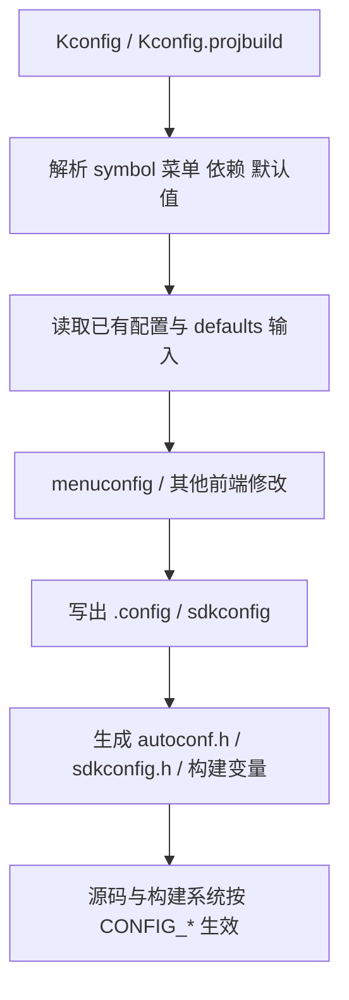
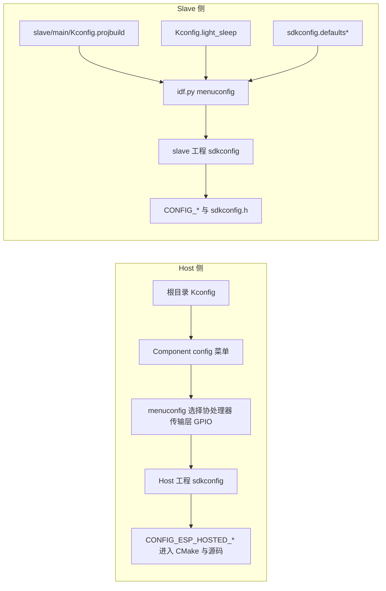

# Kconfig 详解：从通用配置语言到 ESP-Hosted-MCU 实践

本文档先解释通用 Kconfig 是什么、为什么 Linux 内核、Zephyr、ESP-IDF 这类系统都在使用它，再说明它如何从一组配置描述文件变成最终参与编译的配置结果，最后结合 ESP-Hosted-MCU 仓库说明本项目的 Kconfig 组织方式。

先记住一条主线：Kconfig 负责定义规则，`menuconfig` 负责交互编辑，`.config` / `sdkconfig` 负责保存结果，`autoconf.h` / `sdkconfig.h` 这类文件负责把结果暴露给源码和构建系统。Linux、Zephyr、ESP-IDF 的共性主要在这条主线，差异更多在外层组织方式和结果文件命名。

---

## 1. Kconfig 为什么会被广泛采用

大型系统通常有几个共同问题：

- 一个代码库要覆盖很多芯片、板卡、总线、协议栈和可选功能。
- 某些功能之间有依赖关系，有些又互斥。
- 用户希望通过界面或文本配置启用功能，而不是到处改源码里的宏。
- 构建系统和源码最终都需要读到同一份“最终配置结果”。

Kconfig 之所以被广泛采用，就是因为它把这些问题拆成了两层：

1. 用 Kconfig 文件描述“有哪些可配置项、依赖关系是什么、默认值是什么、菜单怎么组织”。
2. 用配置前端和构建系统，把这些描述求值成一份最终配置结果，再暴露给编译流程和源码。

这也是它在 Linux 内核、Zephyr、ESP-IDF、U-Boot 以及不少嵌入式项目里都成立的原因。项目背景不同，但需求非常相似：都需要管理大量编译期可变项。

Kconfig 适合解决的是“编译期功能裁剪”和“配置约束管理”，它通常不负责下面这些事情：

- 不负责真正执行编译，执行编译的是 Make、CMake、Ninja 等构建系统。
- 不负责运行时配置，运行时配置通常来自 NVS、文件、命令行、网络下发参数等。
- 不负责硬件拓扑的完整描述。在 Zephyr 里，硬件描述更多由 Devicetree 负责；Devicetree 同样采用分层、模块化描述，但职责不同于 Kconfig。

---

## 2. 通用 Kconfig 由哪些部分组成

### 2.1 Symbol：配置系统里的基本对象

Kconfig 的核心对象是 symbol，也就是配置符号。最常见的写法是：

```kconfig
config WIFI
    bool "Enable Wi-Fi"
    default y
    help
        Enable Wi-Fi support.
```

这里的 `WIFI` 就是 symbol。它在最终配置结果中，通常会变成类似 `CONFIG_WIFI=y` 的条目，并进一步变成 C 预处理宏或构建变量。

通用 Kconfig 常见类型如下：

| 类型 | 作用 | 常见场景 |
| --- | --- | --- |
| `bool` | 二值开关，`y` 或 `n` | 功能启用/禁用 |
| `tristate` | 三值，`y` / `m` / `n` | Linux 内核里“内建/模块/禁用” |
| `int` | 整数 | 缓冲区大小、GPIO 号、频率 |
| `hex` | 十六进制值 | 地址、位掩码 |
| `string` | 字符串 | 路径、设备名、端口列表 |

要点：

- Linux 内核广泛使用 `tristate`，因为它有“编进内核”和“编成模块”的区别。
- Zephyr 和 ESP-IDF 也沿用 Kconfig 语义，但很多配置更偏向 `bool`、`int`、`string`、`hex`，不强调 Linux 那种模块态工作流。
- 一个 symbol 可以是“可见的”也可以是“不可见的”。没有 prompt 的 symbol 往往是隐藏辅助项，只能通过 `default`、`select`、`imply` 等机制间接改变。

### 2.2 Prompt、Help 和用户可见性

用户在 `menuconfig` 里看到的不是 symbol 名，而是它的 prompt：

```kconfig
config LOG_LEVEL
    int "Default log level"
    range 0 5
    default 2
```

这里：

- `LOG_LEVEL` 是 symbol 名。
- `"Default log level"` 是给用户看的 prompt。
- `range 0 5` 限制了可输入范围。
- `help` 段会显示成帮助文本。

如果一个 symbol 没有 prompt，它就不是给用户直接编辑的，而是给其他配置推导使用的。这类隐藏符号在大型工程里非常常见。

### 2.3 Menu、Choice、If、Source：组织结构的语法

Kconfig 不只是“声明一堆开关”，它还要把它们组织成层级结构。

常见结构元素：

| 关键字 | 作用 |
| --- | --- |
| `menu ... endmenu` | 定义菜单块 |
| `choice ... endchoice` | 定义互斥选择组 |
| `if ... endif` | 给一组条目附加共同条件 |
| `source` | 引入其他 Kconfig 文件 |
| `rsource` | 以相对路径引入其他 Kconfig 文件 |
| `comment` | 在界面中显示说明或警告 |
| `menuconfig` | 定义一个配置项，并提示前端把它视为子菜单入口 |

其中最值得区分的是：

- `menu` 是“纯结构容器”。
- `menuconfig` 本身也是一个 symbol，它既是配置项，又承担菜单入口的语义。

一个典型的互斥选择组如下：

```kconfig
choice NET_STACK
    prompt "Network stack"
    default NET_STACK_TCPIP

    config NET_STACK_TCPIP
        bool "TCP/IP"

    config NET_STACK_CUSTOM
        bool "Custom stack"
endchoice
```

这表示在这个选择组里，只能选中一个子项。

### 2.4 依赖关系：`depends on`、`select`、`imply`

Kconfig 最容易写错的地方，就是依赖关系。

#### `depends on`

`depends on` 用来描述“这个选项只有在某个条件满足时才可见、才可配置”。

```kconfig
config BLE
    bool "Enable BLE"
    depends on BT_CONTROLLER
```

可以把它理解成“上界约束”或“前提条件”。如果依赖不满足，这个 symbol 通常会变灰、隐藏，或者根本不允许取值。

#### `select`

`select` 是反向依赖，用来“强制把另一个 symbol 拉起来”。

```kconfig
config FEATURE_A
    bool "Feature A"
    select FEATURE_A_INTERNAL_HELPER
```

要点：

- `select` 很强势。
- 在通用 Kconfig 语义里，它更像设置另一个 symbol 的下界。
- 它不会像 `depends on` 那样认真替你处理对方的全部依赖，因此滥用很容易制造非法组合。

经验法则：

- `depends on` 用于表达真实前提条件。
- `select` 更适合用于选择隐藏的、简单的、无复杂依赖的辅助 symbol。
- 不要随手用 `select` 去拉起一个有复杂依赖、而且用户本应显式理解的功能项。

#### `imply`

`imply` 可以理解成“弱一点的 select”。它表达的是“我建议你打开它”，但对方仍可能因为依赖、用户显式设置等原因保持关闭。

并不是每个项目都会大量使用 `imply`，但从通用 Kconfig 语义上看，它是比 `select` 更温和的反向依赖工具。

### 2.5 默认值和求值规则

默认值由 `default` 指定：

```kconfig
config UART_BAUD
    int "UART baud rate"
    default 115200
    default 921600 if HIGH_SPEED_UART
```

有几个重要规则：

- 一个 symbol 可以有多个 `default`。
- 如果多个默认值条件都成立，通常取第一个可见的默认值。
- 默认值只在“用户没有显式设置该 symbol”时生效。
- 一旦用户在前端或已有配置文件里明确设置过，默认值往往就不再接管它。

这也是很多人误解的来源：

- “我改了 Kconfig 里的 default，为什么没效果？”
- 很常见的原因是，现有 `.config` 或 `sdkconfig` 已经把这个值固定住了。

### 2.6 三态与可见性

通用 Kconfig 的布尔表达式并不只是普通的 true/false。它底层有一套 `n / m / y` 的求值语义：

- `n` 表示关闭。
- `m` 表示模块态。
- `y` 表示启用。

Linux 内核把这套语义用得最充分，因为模块构建是它的核心能力之一。很多嵌入式项目虽然不强调 `m`，但语义模型仍然来自这套传统。

理解这一点有两个好处：

- 你会知道为什么 Kconfig 里的依赖表达式比普通布尔逻辑更细。
- 你会明白 `depends on` 和 `select` 并不是简单的“显示/隐藏”，而是在参与 symbol 的可取值范围计算。

### 2.7 一个通用 Kconfig 示例长什么样

下面这个例子不绑定任何具体项目，能帮助建立直觉：

```kconfig
menu "Connectivity"

config NET
    bool "Enable networking"
    default y
    help
        Master switch for all networking features.

choice
    prompt "Transport"
    depends on NET
    default TRANSPORT_UART

    config TRANSPORT_UART
        bool "UART"

    config TRANSPORT_SPI
        bool "SPI"

    config TRANSPORT_SDIO
        bool "SDIO"
endchoice

config NET_RX_BUF_COUNT
    int "RX buffer count"
    depends on NET
    range 4 128
    default 16

config NET_INTERNAL_DMA
    bool
    default y if TRANSPORT_SPI || TRANSPORT_SDIO

comment "DMA is enabled automatically for SPI/SDIO"
    depends on NET_INTERNAL_DMA

endmenu
```

这个例子里几乎已经包含了大型项目最常见的几种元素：

- 一个总开关。
- 一个互斥选择组。
- 一个数值型配置项。
- 一个隐藏辅助 symbol。
- 一个根据当前状态动态显示的注释。

---

## 3. Kconfig 是如何生效的

这一节最重要，因为很多人会把 Kconfig 文件、菜单界面和最终配置文件混为一谈。

### 3.1 先区分“描述层”和“结果层”

可以把 Kconfig 体系拆成下面几层：

| 层次 | 典型文件/工具 | 作用 |
| --- | --- | --- |
| 描述层 | `Kconfig`、`Kconfig.projbuild` | 描述有哪些配置项、约束和菜单 |
| 输入层 | `.config`、`prj.conf`、`sdkconfig.defaults`、已有 `sdkconfig` | 给 symbol 提供初始值或用户值 |
| 交互层 | `menuconfig`、`nconfig`、VS Code 配置编辑器 | 让用户查看和修改配置 |
| 结果层 | `.config`、`sdkconfig` | 保存求值后的最终配置 |
| 派生层 | `autoconf.h`、`sdkconfig.h`、CMake/Make 变量 | 让源码和构建系统消费最终结果 |

一句话概括：

- Kconfig 文件定义规则。
- 配置文件保存结果。
- 前端负责编辑。
- 构建系统把结果喂给编译器和源码。

### 3.2 通用生效链路

不管是 Linux、Zephyr 还是 ESP-IDF，整体流程都可以抽象成这样：



更细一点，可以分成 7 步：

1. 解析入口 Kconfig，并递归 `source`/`rsource` 其他文件。
2. 建立 symbol 表、菜单树、依赖关系和默认值集合。
3. 读入已有配置结果或默认配置输入。
4. 对每个 symbol 求值，决定它当前是否可见、可改、默认是什么。
5. 用户通过 `menuconfig` 或文本片段进一步修改。
6. 写出最终配置结果，例如 `.config` 或 `sdkconfig`。
7. 生成供构建系统和源码使用的派生文件，例如 `autoconf.h`、`sdkconfig.h` 或构建变量。

### 3.3 结果是如何被源码和构建系统消费的

Kconfig 本身不编译代码，但它最终会影响三类东西：

#### 1. 预处理宏

```c
#if CONFIG_WIFI
wifi_init();
#endif
```

#### 2. 构建脚本条件

Linux Makefile 常见写法：

```make
obj-$(CONFIG_FOO) += foo.o
```

ESP-IDF / CMake 常见写法：

```cmake
if(CONFIG_ESP_HOSTED_USE_MEMPOOL)
    list(APPEND COMPONENT_SRCS mempool.c)
endif()
```

#### 3. 代码路径裁剪

配置结果会影响：

- 哪些源文件被加入构建。
- 哪些功能分支被编译进去。
- 某些缓冲区、频率、GPIO、协议参数用什么默认值。

所以 Kconfig 的本质不是“生成一个菜单”，而是“驱动整个编译期变体系统”。

---

## 4. Linux、Zephyr、ESP-IDF 的共性与差异

前面几节讲的是 Kconfig 这门配置语言本身怎么工作。接下来把视角切到不同生态的落地方式，先做一次横向比较，再逐步收束到 ESP-IDF，这样更容易分清哪些是 Kconfig 的共性，哪些只是各家工程包装的差异。

### 4.1 共性

三者的共同点很明确：

- 都用 Kconfig 描述配置符号和依赖关系。
- 都提供交互式配置前端，例如 `menuconfig`。
- 都会把最终配置写成一份结果文件，再生成头文件给源码使用。
- 都会把 `CONFIG_*` 形式的配置暴露给构建系统和代码。

也就是说，Kconfig 在这三个生态里都扮演同一个角色：

“构建期配置约束语言”。

### 4.2 差异

| 维度 | Linux 内核 | Zephyr | ESP-IDF |
| --- | --- | --- | --- |
| 结果文件 | `.config` | 最终生成 `.config`，应用常写 `prj.conf` 作为输入片段 | `sdkconfig` |
| 交互入口 | `make menuconfig`、`nconfig`、`xconfig` | `west build -t menuconfig` 等 | `idf.py menuconfig`、VS Code 扩展 |
| 头文件 | `autoconf.h` 等 | `autoconf.h` | `sdkconfig.h` |
| 模块语义 | `tristate` 很重要，`m` 非常常见 | 语义沿用 Kconfig，但更偏嵌入式静态构建 | 更偏嵌入式静态构建，通常不走 Linux 模块工作流 |
| 典型输入层 | defconfig、已有 `.config`、架构默认配置 | 板级 defconfig、`prj.conf`、配置片段 | `sdkconfig.defaults`、已有 `sdkconfig` |
| 与硬件描述关系 | 多靠 Kconfig 和平台代码 | 明显区分 Kconfig 与 Devicetree | 多数硬件功能仍通过 Kconfig 和组件配置暴露 |

### 4.3 对 Zephyr 的一个常见误解

很多人会说“Zephyr 的板级配置也是 Kconfig”，这句话只说对了一半。

更准确地说：

- Zephyr 用 Kconfig 管理功能、策略、子系统开关。
- Zephyr 用 Devicetree 管理硬件实例、外设拓扑和引脚等硬件描述。

所以在 Zephyr 里，Kconfig 很重要，但它不是唯一的配置来源。

### 4.4 对 ESP-IDF 的一个常见误解

很多人会把 `sdkconfig` 当成 Kconfig 本身，这其实把“规则”和“结果”混在了一起。更准确地说，`Kconfig` / `Kconfig.projbuild` 负责定义规则，`sdkconfig` 是求值结果，`sdkconfig.defaults` 只是初始化这些结果的输入之一。

关于 ESP-IDF 中多份默认配置文件的精确加载顺序、`SDKCONFIG_DEFAULTS` 的展开方式、以及某些前端细节，需要以本地使用的 ESP-IDF 版本为准；不同版本的实现细节可能略有差异。本文重点解释机制，不把某个具体版本的实现细枝末节写死成“唯一真相”。

---

## 5. ESP-IDF 里的 Kconfig 一般是怎么落地的

如果把上一节看成横向比较，这一节就是把镜头收回到 ESP-IDF。先认清 ESP-IDF 里最常见的几个配置角色，后面再看本仓库的文件组织时，就不容易把“框架机制”和“项目实现”混在一起。

在 ESP-IDF 里，最常见的几个角色是：

### 5.1 `Kconfig`

通常用于组件级配置描述。组件被项目引入后，它的配置项会出现在 `menuconfig` 里，常见位置是 `Component config` 下。

### 5.2 `Kconfig.projbuild`

这是 ESP-IDF 的项目级配置入口之一。它更像“把某些配置直接挂到项目配置树里”，常用于应用或主工程层面暴露选项。

### 5.3 `sdkconfig`

这是最终求值结果文件。它记录了当前工程实际采用的 `CONFIG_*` 值。

### 5.4 `sdkconfig.defaults` 与 `sdkconfig.defaults.<target>`

这是默认配置输入文件，常用于：

- 给新工程或特定目标芯片提供初始值。
- 让团队共享一套推荐配置。
- 给 CI、样例工程或板级组合提供稳定起点。

关键点：

- 它本身不是配置规则。
- 它不能凭空引入一个未在 Kconfig 中声明的 symbol。
- 它更像是“给已有 symbol 填值”的种子文件。

这里的 `sdkconfig.defaults*` 指 `sdkconfig.defaults` 以及 `sdkconfig.defaults.<target>` 这类文件。

它和 Kconfig 里的 `default` 不在同一层级，可以这样理解：

| 机制 | 写在哪里 | 作用 |
| --- | --- | --- |
| Kconfig `default` | 写在 symbol 定义旁边 | 提供规则层默认值 |
| `sdkconfig.defaults*` | 写在项目 defaults 文件中 | 提供项目层初始值 |

两者的对应关系，本质上就是同一个 symbol 名的对应关系。例如，Kconfig 中写 `config SUBLIGHT_SPEED`，那么在 `sdkconfig.defaults` 里对应写法就是 `CONFIG_SUBLIGHT_SPEED=42`。

如果同一个 symbol 同时在 Kconfig 里有 `default`，又在 `sdkconfig.defaults*` 里被赋值，那么通常以 `sdkconfig.defaults*` 为准，因为在 ESP-IDF 的配置加载流程里，它属于后加载的项目级用户默认值。

可以把常见优先级粗略理解成下面这条链：

1. Kconfig `default`：提供最基础的默认值。
2. `sdkconfig.defaults*`：覆盖 Kconfig `default`，作为项目或目标芯片的初始默认值。
3. 已有 `sdkconfig`：如果其中已经有该 symbol 的值，通常优先于前两者。

如果存在多份 defaults 输入文件，那么它们之间也有先后顺序：

- 先应用前面的 defaults 文件。
- 再应用对应的目标芯片变体文件，例如 `sdkconfig.defaults.esp32c6`。
- 如果后面的 defaults 文件再次设置同一个 key，则以后者为准。

所以从“谁优先级更高”这个问题看，常见结论可以简化成：已有 `sdkconfig` > `sdkconfig.defaults*` > Kconfig `default`。

### 5.5 `idf.py menuconfig`

这是交互式配置入口。用户修改完成后，ESP-IDF 会把结果保存到 `sdkconfig`，并生成供构建系统和源码使用的派生配置。

### 5.6 一个 symbol 的完整流转示例

假设有这样一个配置项：

```kconfig
config SUBLIGHT_SPEED
    int "Sublight speed"
    default 10
```

同时项目里有这样一条默认输入：

```text
CONFIG_SUBLIGHT_SPEED=42
```

那么一个典型流程可以概括成：

| 阶段 | `SUBLIGHT_SPEED` 的来源 | 结果 |
| --- | --- | --- |
| 只有 Kconfig | `default 10` | 取值为 `10` |
| 加入 `sdkconfig.defaults*` | 项目 defaults 覆盖 Kconfig 默认值 | 取值变为 `42` |
| 用户在 `menuconfig` 中改成 `64` | 用户值写入 `sdkconfig` | 取值变为 `64` |
| 之后再次打开前端 | 读取已有 `sdkconfig` | 仍优先使用 `64` |
| 删除 `sdkconfig` 后重新生成 | 回到初始化流程 | 再次从 `42` 开始 |

这个例子说明的就是同一件事：

- Kconfig `default` 负责兜底。
- `sdkconfig.defaults*` 负责项目初始值。
- `sdkconfig` 负责保存当前工程已经确认下来的实际值。

---

## 6. 本仓库里的 Kconfig 是如何组织的

前一节回答的是“ESP-IDF 一般怎么组织配置”，这一节开始回答“ESP-Hosted-MCU 具体把这些角色放在了哪里”。从这里开始，视角就从通用实践切到仓库落地。

ESP-Hosted-MCU 同时覆盖 host 侧和 slave 侧，因此它的配置体系天然分成两部分。

### 6.1 根目录 `Kconfig`：Host 侧组件配置

仓库根目录的 `Kconfig` 主要描述 host 侧的 ESP-Hosted 组件配置。它的特点很鲜明：

- 有一个总开关 `ESP_HOSTED_ENABLED`。
- 用 `menu "ESP-Hosted config"` 把 Host 相关配置组织在一起。
- 用 `choice ESP_HOSTED_CP_TARGET` 选择协处理器目标。
- 用隐藏辅助 symbol 表示某些能力是否可用，例如 `ESP_HOSTED_PRIV_SDIO_OPTION`、`ESP_HOSTED_PRIV_SPI_HD_OPTION`。
- 用大量条件 `default` 做开发板和目标芯片相关的默认 GPIO 映射。

从开头部分就能看到这种结构：

```kconfig
config ESP_HOSTED_ENABLED
    bool "Enable ESP-Hosted component"

menu "ESP-Hosted config"
    depends on ESP_HOSTED_ENABLED

    choice ESP_HOSTED_CP_TARGET
        bool "Choose the Co-processor to use"
```

这是一种很典型的 Kconfig 组织方式：

- 先有总开关。
- 再在总开关之下展开整个子系统的配置树。
- 再用 `choice`、`menu`、隐藏辅助项把派生行为组织起来。

根目录 `Kconfig` 里还有一个很实用的模式：

- 通过条件默认值，为不同 Host 板卡和协处理器组合提供预设 GPIO。

这比在 C 代码里堆很多板卡判断要更干净，因为板级差异被放回了“配置层”，而不是散落在实现层。

### 6.2 `slave/main/Kconfig.projbuild`：Slave 侧项目配置

`slave/main/Kconfig.projbuild` 主要服务协处理器固件。它的入口是：

```kconfig
menu "Example Configuration"
```

这个文件主要负责：

- 协处理器侧 Wi-Fi / BT 开关。
- 协处理器是否使用内置 `app_main()`。
- 板卡选择和自动 GPIO 映射。
- Host 与 Co-processor 之间的传输层选择。
- Network Split、Host Power Save 等项目级功能配置。

这里同样大量使用了典型 Kconfig 技法：

- `choice` 表达互斥传输层。
- 条件 `default` 表达不同芯片/开发板默认 GPIO。
- `comment` 做状态说明和警告。
- 隐藏 symbol 保存派生值。

比如 Slave 侧传输层就是标准的互斥建模：

```kconfig
choice ESP_HOST_INTERFACE
    bool "Transport layer"
    default ESP_UART_HOST_INTERFACE if IDF_TARGET_ESP32H4
    default ESP_SDIO_HOST_INTERFACE if SOC_SDIO_SLAVE_SUPPORTED
    default ESP_SPI_HOST_INTERFACE
```

这段就很好地体现了 Kconfig 的价值：

- 传输层是“互斥选择”。
- 默认值会根据目标芯片能力变化。
- 用户仍可以在允许范围内覆写。

### 6.3 `slave/main/Kconfig.light_sleep`：拆分出来的子配置模块

`slave/main/Kconfig.projbuild` 在仓库里通过下面这句引入轻睡眠配置：

```kconfig
rsource "Kconfig.light_sleep"
```

这说明本项目没有把所有配置都塞进一个巨型文件，而是把相对独立的电源管理主题拆到了单独文件里。这是非常健康的做法。

`Kconfig.light_sleep` 里有几个很值得学习的模式：

#### 1. 用 `choice` 表达模式切换

```kconfig
choice ESP_HOSTED_LIGHT_SLEEP_POWER_MODE
    prompt "Light Sleep Power Management"
    default ESP_HOSTED_LIGHT_SLEEP_POWER_DISABLED
```

这比堆多个互相排斥的 `bool` 更清晰。

#### 2. 用 `select` 自动拉起简单依赖

例如：

```kconfig
config ESP_HOSTED_LIGHT_SLEEP_POWER_MIN
    bool "Minimum Power Saving (development mode)"
    select PM_ENABLE
    select FREERTOS_USE_TICKLESS_IDLE
```

这类用法是合理的，因为它表达的是“一键模式”自动开启一组基础能力。

但它也再次提醒我们：

- `select` 应该谨慎使用。
- 如果被拉起的 symbol 依赖复杂，或者本应由用户显式理解，就要小心不要把配置关系写乱。

#### 3. 用隐藏 symbol 保存派生状态

例如：

```kconfig
config ESP_HOSTED_LIGHT_SLEEP_ENABLE
    bool
    default y if ESP_HOSTED_LIGHT_SLEEP_POWER_MIN || ESP_HOSTED_LIGHT_SLEEP_POWER_MAX || ESP_HOSTED_LIGHT_SLEEP_POWER_MANUAL
    default n
```

这是非常典型的“派生状态 symbol”：

- 用户不直接编辑它。
- 但很多子菜单和参数可以统一依赖它。

#### 4. 用 `comment` 做动态诊断

这个文件还大量用 `comment ... depends on ...` 把“缺什么依赖、该去哪里打开”直接显示在菜单界面里。这种做法对可维护性和可用性都很好，因为它把配置错误提示前移到了前端，而不是留到编译失败之后再排查。

### 6.4 `sdkconfig.defaults*` 在本仓库里的角色

本仓库 `slave/` 目录下有多份：

- `sdkconfig.defaults`
- `sdkconfig.defaults.esp32`
- `sdkconfig.defaults.esp32c2`
- `sdkconfig.defaults.esp32c3`
- `sdkconfig.defaults.esp32c5`
- `sdkconfig.defaults.esp32c6`
- 以及其他目标芯片对应文件

这些文件在本仓库里的职责可以直接理解成两层：

- `sdkconfig.defaults`：提供所有协处理器目标共享的通用初始值。
- `sdkconfig.defaults.<target>`：在通用初始值之上，为特定芯片追加或覆盖更细的默认值。

结合前一节的通用规则，这里可以把关系收敛成一句话：

- `Kconfig` / `Kconfig.projbuild` 决定“能配什么”。
- `sdkconfig.defaults*` 决定“新配置一开始填什么值”。
- `sdkconfig` 决定“当前工程这次实际用什么值”。

在本仓库里，最常见的行为是：

- 已有 `sdkconfig` 时，`sdkconfig.defaults*` 通常不会重新覆盖其中已写入的 symbol。
- 新增 symbol、缺失 symbol，或删除 `sdkconfig` 后重新生成时，`sdkconfig.defaults*` 会再次参与初始化。
- 如果同一个 key 同时出现在通用 defaults 和目标 defaults 中，通常以后加载的目标 defaults 为准。

---

## 7. 本项目里的两条典型生效链路

看完文件分工之后，再把它们串成生效链路，通常更容易建立整体感。下面分别从 Host 和 Slave 两侧看一次“配置从定义到结果”的路径。



### 7.1 Host 侧

当 ESP-Hosted 作为组件被 Host 示例工程引用时，大致链路是：

```text
根目录 Kconfig
  -> 出现在 ESP-IDF 的 Component config 菜单中
  -> 用户在 menuconfig 中选择协处理器、传输层、GPIO 等
  -> 结果写入 Host 工程的 sdkconfig
  -> CONFIG_ESP_HOSTED_* 进入 CMake 和源码
  -> 决定 Host 侧编译了哪些驱动和参数
```

### 7.2 Slave 侧

在 `slave/` 工程中，大致链路是：

```text
slave/main/Kconfig.projbuild
  + rsource Kconfig.light_sleep
  + sdkconfig.defaults / sdkconfig.defaults.<target>
  -> idf.py menuconfig
  -> 生成 slave 工程的 sdkconfig
  -> 生成 CONFIG_* 和 sdkconfig.h
  -> 决定协处理器侧功能与参数
```

这两条链路共享同一套思想，但配置入口和落点不同。

---

## 8. 常见误区与最佳实践

### 8.1 `depends on` 和 `select` 不是一回事

最常见的错误是把 `select` 当成“更方便的 depends on”。

正确理解应该是：

- `depends on` 表达前提条件。
- `select` 表达反向拉起。

如果你要描述“没有 A，就不应该允许 B”，优先考虑 `depends on A`。

如果你要描述“开启这个内部模式时，顺手把某个隐藏 helper 也打开”，才考虑 `select`。

### 8.2 改了默认值不等于用户值会变化

默认值只在 symbol 还没有被用户显式固定时才有机会生效。

所以当你：

- 改了 `default`；或
- 改了 `sdkconfig.defaults*`；

但已有工程早就生成过 `sdkconfig`，就很可能看不到变化。

这里最好把两种常见操作分开理解：

- 删除整个 `sdkconfig`：配置系统会重新走初始化流程，`sdkconfig.defaults*` 会再次参与为各个 symbol 填初始值。
- 在前端里只对某一个 symbol 做重置：本质上是去掉这个 symbol 的显式用户值，然后它回退到当前仍然成立的默认来源，可能是 Kconfig `default`，也可能仍然是 `sdkconfig.defaults*`。

排查方向通常是：

- 当前工程里是否已经存在 `sdkconfig`。
- 该 symbol 是否已经在旧配置中被显式赋值。
- 该 symbol 是否其实是后来新增、而旧 `sdkconfig` 里根本还没有这一项。
- 是否删除过整个 `sdkconfig` 并重新生成配置，使系统重新从 `sdkconfig.defaults*` 初始化。
- 是否需要手动同步旧配置，或直接重新生成一份新 `sdkconfig`。

### 8.3 隐藏 symbol 是正常设计，不是“写漏了 prompt”

很多辅助 symbol 本来就不应该暴露给用户。它们常用于：

- 保存派生状态。
- 汇总多个条件。
- 给 C/CMake 提供统一判断点。

像本仓库里的 `ESP_HOSTED_PRIV_SDIO_OPTION`、`ESP_HOSTED_LIGHT_SLEEP_ENABLE` 就属于这种设计。

### 8.4 把板级预设放在 Kconfig 默认值里，通常比写死在源码里更好

如果差异本质上是“配置差异”，例如：

- 默认 GPIO 号不同。
- 默认传输接口不同。
- 某块板默认打开某个能力。

那么优先放在 Kconfig 的条件 `default` 里，通常比在 C 代码中散落 `if board == ...` 更利于维护。

### 8.5 大型 Kconfig 文件要拆分主题

当配置系统变大以后，推荐：

- 顶层只保留主菜单和主路径。
- 子主题拆到独立文件。
- 用 `source` 或 `rsource` 组织。

`slave/main/Kconfig.light_sleep` 就是一个正面的例子。

### 8.6 让菜单界面自己解释错误

好的 Kconfig 不只是“能表达依赖”，还应该“能帮助用户理解依赖”。

实践上可以这样做：

- 写清楚 `help`。
- 用 `comment` 显示动态警告。
- 把模式化能力建模为 `choice`。
- 用隐藏 helper symbol 减少重复条件。

本仓库的 light sleep 配置就体现了这种风格。

---

## 9. 排查思路：配置为什么没按预期生效

| 现象 | 常见原因 | 排查方向 |
| --- | --- | --- |
| 菜单项是灰的或看不见 | `depends on` 不满足 | 看它的依赖链和父菜单条件 |
| 某个配置被自动打开 | 被其他 symbol `select` 了 | 查谁在反向拉起它 |
| 改了 `default` 没效果 | 已有配置文件固定了旧值 | 检查 `.config` 或 `sdkconfig` |
| `sdkconfig.defaults*` 改了没效果 | 旧 `sdkconfig` 仍生效 | 重新初始化或同步配置 |
| 代码里 `CONFIG_*` 不存在 | symbol 未定义或命名不一致 | 先确认 Kconfig 是否真的声明了它 |
| 子菜单结构很乱 | 子项没有正确依赖父项 | 检查 `menuconfig` / `depends on` 组织方式 |

如果前端支持查看 symbol 来源，优先看：

- 它定义在哪个 Kconfig 文件。
- 它依赖什么。
- 谁 `select` 了它。
- 当前值来自默认值、已有配置还是用户输入。

---

## 10. 总结

理解 Kconfig，最重要的是把几个概念分开：

- Kconfig 文件是规则，不是结果。
- `menuconfig` 是编辑器，不是配置本身。
- `.config`、`sdkconfig` 是求值结果。
- `autoconf.h`、`sdkconfig.h` 和构建变量是结果的派生形式。

从通用视角看，Kconfig 是一门用来描述“可编译变体”的声明式语言；从工程视角看，它是把产品线复杂度约束在配置层，而不是散落到源码里的关键工具。

回到 ESP-Hosted-MCU，本仓库的配置体系有三个典型层次：

- 根目录 `Kconfig` 负责 Host 侧组件配置。
- `slave/main/Kconfig.projbuild` 负责协处理器工程级配置。
- `slave/main/Kconfig.light_sleep` 负责拆分出的电源管理子主题。

再加上 `sdkconfig.defaults*` 这组默认值输入文件，就构成了一套很标准、也很有代表性的 ESP-IDF Kconfig 实践。
